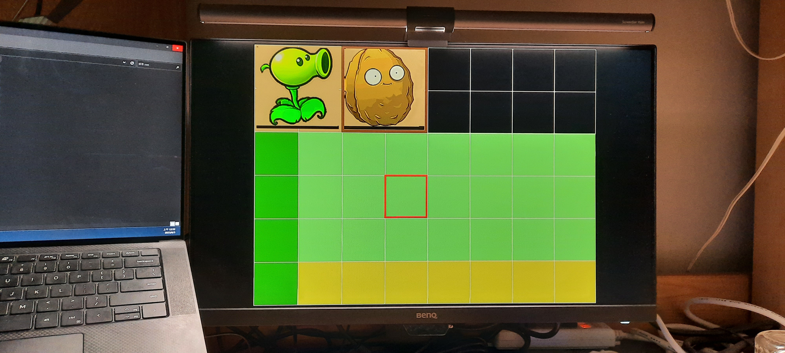
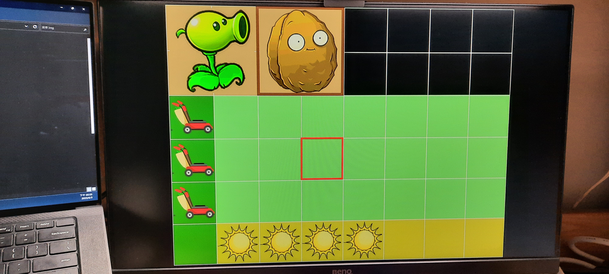
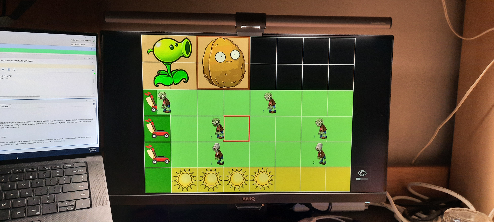
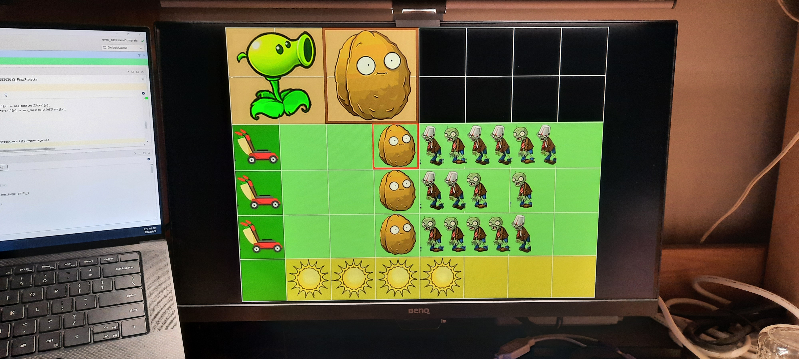
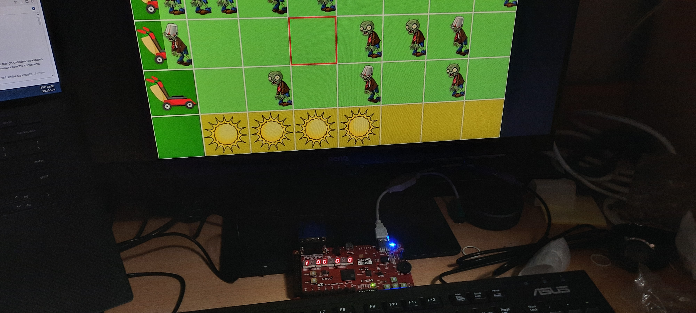
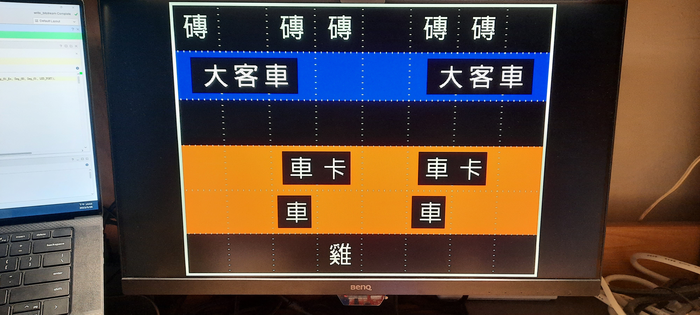
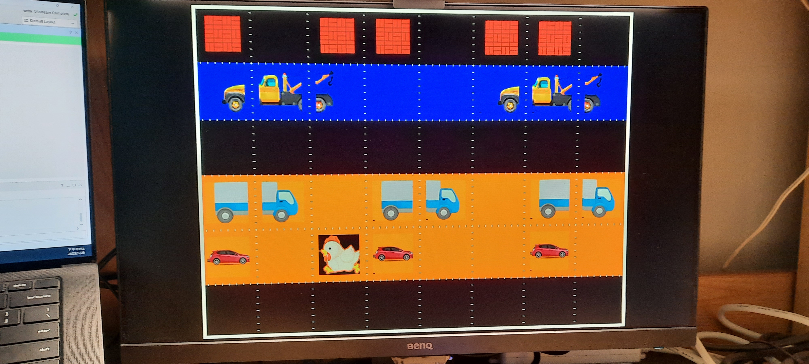
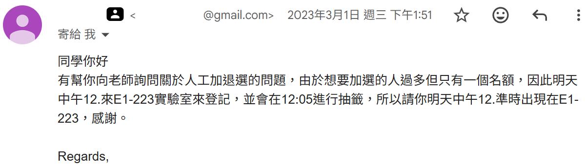

# NCU-Digital-System-Design-and-Implementation-2023
## 簡介
- **學校** : 國立中央大學
- **開課單位** : 電機工程學系
- **課程名稱** : 數位系統設計與實作
- **授課教授** : 蔡佩芸 教授
- **修課時間** : 2023年02月~2023年06月
- **最終成績** : 87

## 成績概況
||HW AVG|Final Project|Final Exam|期末考點名|實驗課點名|總成績|
|---|---|---|---|---|---|---|
|配分|45%|20%|25%|5%|5%|100%|
|實得|84.74|100|50 * 1.5(調分)|100|100|87|

## 作業概況
||HW1|HW2|HW3|Lab1|Lab2|Lab3|Lab4|Lab5|
|---|---|---|---|---|---|---|---|---|
|配分|100%|100%|100%(demo 50%)|100%(demo 50%)|100% (demo 50%)|100%(demo 50%)|(demo 50%)|100%(demo 50%)|
|實得|95|90|130|80(50)|95(50)|25(50)|(50)|40(50)|

## 期末考概況
||第一題|第二題|第三題|第四題|第五題|第六題|第七題|總分|
|---|---|---|---|---|---|---|---|---|
|配分|10%|10%|12%|15%|20%|13%|20%|100%|
|實得|10 |10 |0  |15 |15 |0  |0  | 50 |
- 備註:第六題及第七題無人答對

## 期末專題
- 說明:設計一款「植物大戰殭屍」的遊戲，利用LED、七段顯示器、螢幕及按鈕做出一個守城遊戲。撿起陽光並召喚植物，打敗向家園襲來的殭屍群
- 報告:[report_final_project](./report/FinalProject_108303013.pdf)
- 影片:[YT影片_final_project](https://youtube.com/shorts/_rdwBCLZNwI)
- 照片:
    - 確認地圖顏色(橘色為植物選擇區域、淺綠為殭屍行進區域、深綠為終點線及黃色為陽光生長區域)及可以選擇放置植物的位置(紅框)
        
    - 確認可以選擇放置何種植物(棕框)
        
    - 確認地圖中終點線(除草機)及陽光生長區域
        
    - 確認殭屍可以正常生成並移動
        
    - 確認移動中的殭屍會被堅果牆(wall-nut)所擋住
        
    - 確認FPGA板會正確顯示難度、陽光數量、正常僵屍數量及水桶僵屍數量，LED有正確顯示僵屍進攻倒數、關卡完成及關卡失敗
        

## 期末考試
- 說明:設計一款在捲積(convolution)中3x3的移動視窗(sliding window)，該視窗可以根據不同模式來找出最大值、最大值出現的(x,y)數值及是否為最大值
- 程式:[code_final_exam](./final_exam/FinalTerm.srcs/sources_1/new/DSD108303013.v)
- 測資:[testbench_final_exam](./final_exam/FinalTerm.srcs/sim_1/new/DSD108303013_tb.v)

## 作業介紹
1. HW01: Introduction to Verilog
   - 說明:學習組合邏輯電路(Combinational Circuits)及如何撰寫測資(testbench)，輸入不同位元，經過不同邏輯閘/多工器，並觀察輸出結果
   - 程式:[code_hw01](./hw01/EX1.srcs/sources_1/new/HW1_108303013.v)
   - 測資:[testbench_hw01](./hw01/EX1.srcs/sim_1/new/HW1_tb_108303013.v)
   - 報告:[report_hw01](./report/HW1_108303013.pdf)

2. HW02: Modeling Sequential Circuits
   - 說明:學習循序邏輯電路(Sequential Circuits)，藉由輸入clk及Din，觀察多級正反器後的輸出結果
   - 程式:[code_hw02](./hw02/EX2.srcs/sources_1/new/108303013_HW2.v)
   - 測資:[testbench_hw02](./hw02/EX2.srcs/sim_1/new/108303013_HW2_tb.v)
   - 報告:[report_hw02](./report/HW2_108303013.pdf)

3. HW03: Modeling Finite State Machine 
   - 說明:設計一款紅白機中的「大金剛(Donkey Kong)」的遊戲，藉由輸入向左、向右及向上的指令來控制玩家的移動，並且要避開守衛，跟獲得金塊才能抵達終點。此作業需要切換不同的狀態機來實現關卡要求
   - 程式:[code_hw03](./hw03/EX3.srcs/sources_1/new/108303013_HW3.v)
   - 測資:[testbench_hw03](./hw03/EX3.srcs/sim_1/new/108303013_HW3_tb.v)
   - 報告:[report_hw03](./report/HW3_108303013.pdf)

## 實驗介紹
1. Lab01: Seven-segment & LED Display
   - 說明:藉由撥動指撥開關的不同位元，會決定LED的跑馬燈及七段顯示器顯示不同的英文字母
   - 程式:[code_lab01](./lab01/Lab1.srcs/sources_1/new/108303013_Lab1.v)
   - 測資:[testbench_lab01](./lab01/Lab1.srcs/sim_1/new/108303013_Lab1_tb.v)
   - 報告:[report_lab01](./report/Lab1_108303013.pdf)

2. Lab02: Seven-segment & LED Display
   - 說明:藉由撥動開關的不同位元，會決定LED的跑馬燈的頻率及七段顯示器顯示不同的數字
   - 程式:[code_lab02](./lab02/Lab2.srcs/sources_1/new/108303013_Lab2.v)
   - 測資:[testbench_lab02](./lab02/Lab2.srcs/sim_1/new/108303013_Lab2_tb.v)
   - 報告:[report_lab02](./report/Lab2_108303013.pdf)

3. Lab03: Keyboard and Debounce
   - 說明:設計一款「寶可夢」的遊戲，藉由PS2鍵盤輸入不同的字元會決定要使用哪種寶貝球，藉由開關會決定薰香及是否丟球。將薰香等級及面對的寶可夢等級顯示在七段顯示器上，LED會隨時間顯示捉捕中、捉捕成功及捉捕失敗
   - 程式:[code_lab03](./lab03/Lab3.srcs/sources_1/new/108303013_Lab3.v)
   - 測資:[testbench_lab03](./lab03/Lab3.srcs/sim_1/new/108303013_Lab3_tb.v)
   - 報告:[report_lab03](./report/Lab3_108303013.pdf)

4. Lab04:
   - 說明:設計一款「小雞過馬路」的遊戲，將「小雞」、「小車」、「貨車」、「大卡車」及「牆壁」的圖片透過VGA呈現在螢幕上。每格像素為80x80，總共具有8x6格，格與格之間以5像素的線隔開
   - 程式:[code_lab04](./lab04/Lab4.srcs/sources_1/new/108303013_Lab4.v)
   - 報告:[report_lab04](./report/Lab4_108303013.pdf)

5. Lab05:
   - 說明:延續Lab04，設計一款「小雞過馬路」的遊戲，藉由按壓按鈕會改變小雞的位置，圖中的載具(「小車」、「貨車」、「大卡車」)會隨著時間朝著不同方向前進，玩家需要想辦法帶領小雞通過關卡抵達終點。透過七段顯示器呈現「累積步數」及「得分」，小雞在遇到若成功過關，LED會向流水燈呈現通關樣式
   - 程式:[code_lab05](./lab05/Lab4.srcs/sources_1/new/108303013_Lab5.v)
   - 報告:[report_lab05](./report/Lab5_108303013.pdf)
   - 影片:[YT影片_lab05](https://youtube.com/shorts/ejkAIsAO7JI)
   - 圖片:
       - 測試階段
           
       - 最終結果
           

## 開發環境與需求
1. software - Vivado 2020.1
   
   [Download Link - Vivado 2020.1](https://www.xilinx.com/support/download.html)

2. FPGA board - Xilinx Artix-7 EGO1

   IC : xc7a35tcsg324-1

## 修課心得
我是在加退選階段的最後一天，才選上這極度熱門的實作課程。由於FPGA板子有限，修課學生又多為電機系，這門課很少有外系學生能修到。
回想開放加簽的時間(2023 年 3 月 2 日中午 12 點)，最後只有我一人出現！ 我從一開始的旁聽生，到最後成為唯一加簽的學生，這段過程令人難忘。
無數個夜晚加班寫程式的努力沒有白費，我也確實將老師傳授的 Verilog 課程觀念吸收。如今回頭看 Lab05 和 Final Project 的成果，我覺得當初那些熬夜奮鬥改扣的時光非常值得！

- 加簽通知信件

